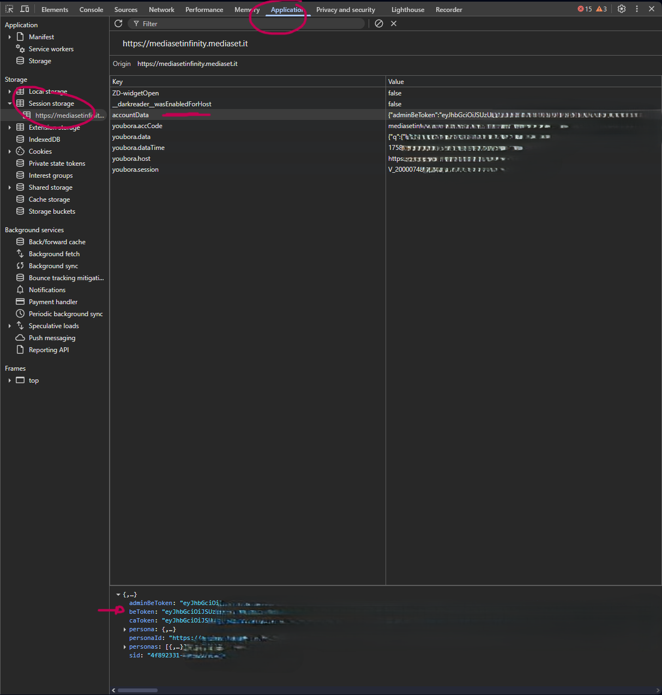
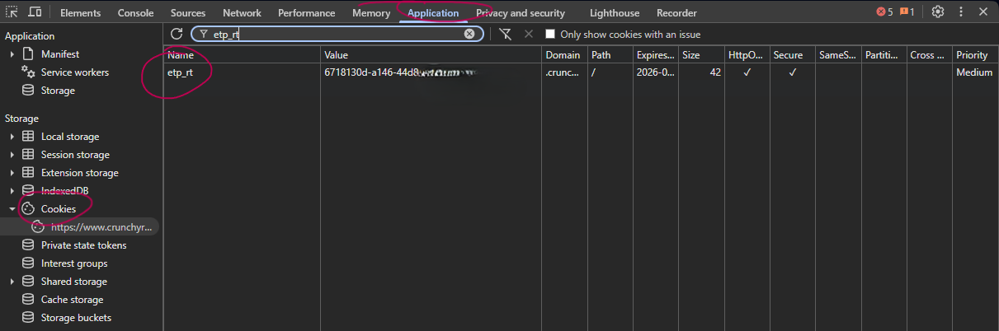
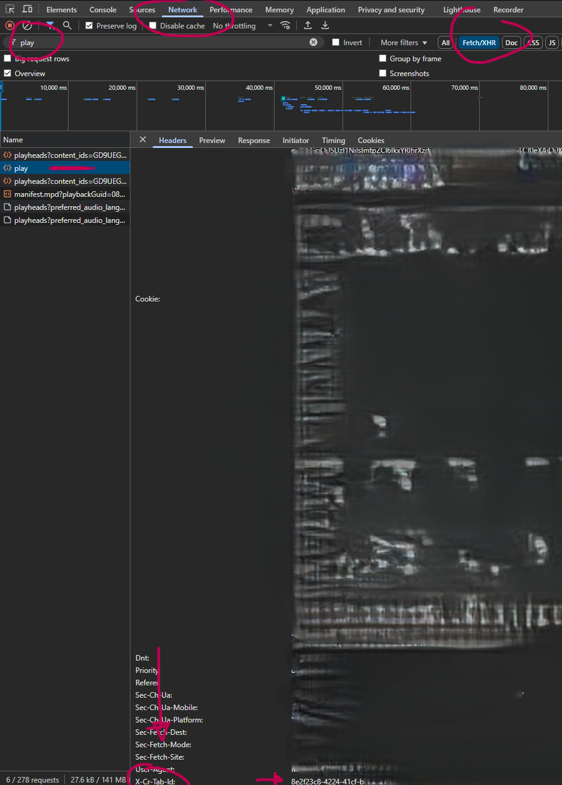

# How to Extract Login Keys

Follow the instructions below to obtain the required keys for each streaming service and add them to your `config.json`.

<Tabs>
<TabItem value="mediasetinfinity" label="Mediaset Infinity">

## Mediaset Infinity: Get `beToken`

1. **Log in** to [Mediaset Infinity](https://mediasetinfinity.mediaset.it).

2. **Open Developer Tools** (press <kbd>F12</kbd>).

3. Go to the **Application** tab (or **Storage** in some browsers).

4. Find `beToken` in:
   - **Cookies** for the site, or
   - **Session Storage** under `accountData`.

5. **Copy** the value of `beToken` and paste it into your `config.json`.

</TabItem>
<TabItem value="crunchyroll" label="Crunchyroll">

## Crunchyroll: Get `etp_rt` and `x_cr_tab_id`

1. **Log in** to [Crunchyroll](https://www.crunchyroll.com/).

2. **Open Developer Tools** (<kbd>F12</kbd>).

3. **Get `etp_rt`:**
   - Go to the **Application** tab.
   - Find the `etp_rt` cookie under **Cookies** for the site.
   - **Copy** its value for `config.json`.
   - 
   
4. **Get `x_cr_tab_id`:**
   - Start playing any video.
   - Go to the **Network** tab.
   - Filter by **XHR** requests.
   - Select a request and find the `x-cr-tab-id` header.
   - **Copy** its value for `config.json`.
   - 

</TabItem>
</Tabs>
